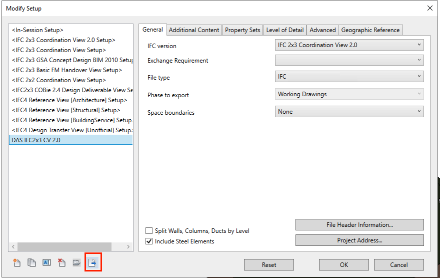

# Revit IFC Exporter App bundle for Autodesk APS Design Automation

[](http://developer.autodesk.com/)


[](https://www.autodesk.com/products/revit/overview/)


[](http://opensource.org/licenses/MIT)

# Description

This sample demonstrates how to implement Revit exporter that supports IFC export options of [Autodesk Revit IFC](https://github.com/Autodesk/revit-ifc).

### Notice

This sample uses the ported classes `IFCExportConfigurationsMap` and `IFCExportConfiguration` from [v25.4.0](https://github.com/Autodesk/revit-ifc/tree/IFC_v25.4.0) of [Autodesk revit-ifc open source addin](https://github.com/Autodesk/revit-ifc) to support exporting IFC with the export settings created from Revit Desktop.

You can the original source code for these two classes under the path [Source
/IFCExporterUIOverride](https://github.com/Autodesk/revit-ifc/tree/master/Source/IFCExporterUIOverride) of [Autodesk revit-ifc open source addin](https://github.com/Autodesk/revit-ifc) and select Revit version you want by switching the git tags (e.g. IFC_v25.4.0).

<details>
    <summary>Pre-steps for using newer or latest Revit IFC exporter from <a href="https://github.com/Autodesk/revit-ifc">Autodesk revit-ifc open source addin</a> on DA.</summary>

1. Downland the version of Revit IFC Addin including the exporter you want to use from the [releases of Autodesk revit-ifc open source addin](https://github.com/Autodesk/revit-ifc/releases) and install it on your local machine. For example, [Release 23.3.1 for Revit 2023](https://github.com/Autodesk/revit-ifc/releases/tag/IFC_v23.3.1.0).
    - Or download the IFC addin source code from [Autodesk revit-ifc open source addin](https://github.com/Autodesk/revit-ifc), and compile to DLLs.
2. Copy all files and folders except for `IFCExporterUIOverride.*` from the Revit IFC addin installation location or the `install` folder when compiling from source code of [Autodesk revit-ifc open source addin](https://github.com/Autodesk/revit-ifc). For example, `C:\ProgramData\Autodesk\ApplicationPlugins\IFC 2023 bundle\Contents\2023`.
3. Put copied files and folders into `RevitIfcExporter.bundle/Contents`. For example, [RevitIfcExporter2023/RevitIfcExporter.bundle/Contents](RevitIfcExporter2023/RevitIfcExporter.bundle/Contents).
4. Modify the copied `Revit.IFC.addin` under `RevitIfcExporter.bundle/Contents` and replace absolute path with local relative paths. For example, the modified paths between the pair of `<Assembly></Assembly>` below:
    ```xml
    <?xml version="1.0" encoding="utf-8"?>
    <RevitAddIns>
    <AddIn Type="DBApplication">
        <Name>BIM IFC Exporter</Name>
        <Assembly>.\Revit.IFC.Export.dll</Assembly>
        <!-- ... -->
    </AddIn>
    <AddIn Type="DBApplication">
        <Name>BIM IFC Importer</Name>
        <Assembly>.\Revit.IFC.Import.dll</Assembly>
        <!-- ... -->
    </AddIn>
    </RevitAddIns>
    ```
5. Modify `RevitIfcExporter.bundle/PackageContents.xml`, and add this line to load Revit.IFC.addin we specified in the `RevitIfcExporter.bundle/Contents`. Here is an example of using Revit IFC addin v23.3.1:
    ```xml
    <?xml version="1.0" encoding="utf-8" ?>
    <ApplicationPackage Name="RevitDesignAutomation" Description="Revit IFC Exporter" Author="aps.help@autodesk.com">
    <CompanyDetails Name="Autodesk, Inc" Url="https://aps.autodesk.com" Email="aps.help@autodesk.com"/>
    <Components Description="Export Revit RVT to IFC">
        <RuntimeRequirements SeriesMin="R2023" SeriesMax="R2023" Platform="Revit" OS="Win64"/>
        <ComponentEntry LoadOnRevitStartup="True" LoadOnCommandInvocation="False" AppDescription="Export Revit RVT to IFC" ModuleName="./Contents/RevitIfcExporter.addin" Version="1.0.0" AppName="RevitIfcExporter"/>
        <ComponentEntry LoadOnRevitStartup="True" LoadOnCommandInvocation="False" AppName="IFC For Revit 2023" Version="23.3.1" AppDescription="IFC For Revit 2023" ModuleName="./Contents/Revit.IFC.addin"/> <!-- <<<Add this line -->
    </Components>
    </ApplicationPackage>
    ```
6. Zip the `RevitIfcExporter.bundle` and upload it to DA.
</details>

# Development Setup

## Prerequisites

1. **APS Account**: Learn how to create a APS Account, activate subscription and create an app at [this tutorial](https://aps.autodesk.com/tutorials).
2. **Visual Studio 2022 and later** (Windows).
3. **Revit 2021 and later**: required to compile changes into the plugin.

## Design Automation Setup

### AppBundle example

```json
{
    "id": "RevitIfcExporter",
    "engine": "Autodesk.Revit+2022",
    "description": "Revit IFC exporter with Revit IFC export options support"
}
```

### Activity example

```json
{
    "id": "RevitIfcExporterActivity",
    "commandLine": [
        "$(engine.path)\\\\revitcoreconsole.exe /i \"$(args[inputFile].path)\" /al \"$(appbundles[RevitIfcExporter].path)\""
    ],
    "parameters": {
        "inputFile": {
            "verb": "get",
            "description": "Input Revit File",
            "required": true,
            "localName": "$(inputFile)"
        },
        "userPropertySetsFile": {
            "verb": "get",
            "description": "IFC user defined property set definition file",
            "localName": "userDefinedParameterSets.txt"
        },
        "userParameterMappingFile": {
            "verb": "get",
            "description": "IFC user defined parameter mapping file",
            "localName": "userDefinedParameterMapping.txt"
        },
        "userExportSettingsFile": {
            "verb": "get",
            "description": "JSON-based User-defined IFC export settings(configuration) file exported from Revit IFC addin",
            "localName": "userExportSettings.json"
        },
        "inputJson": {
            "verb": "get",
            "description": "Input Json parameters",
            "localName": "params.json"
        },
        "outputIFC": {
            "zip": true,
            "verb": "put",
            "description": "Exported IFC files",
            "localName": "ifc"
        }
    },
    "engine": "Autodesk.Revit+2022",
    "appbundles": [
        "Autodesk.RevitIfcExporter+dev"
    ],
    "description": "Activity of Revit IFC Exporter with Autodesk IFC export options support"
}
```

### Workitem example

#### Use userPropertySets filename defined in the IFC export configuration sets and specify addin settings via inline json

```json
{
    "activityId": "Autodesk.RevitIfcExporterActivity+dev",
    "arguments": {
        "inputFile": {
            "verb": "get",
            "url": "https://developer.api.autodesk.com/oss/v2/apptestbucket/9d3be632-a4fc-457d-bc5d-9e75cefc54b7?region=US"
        },
        "userPropertySetsFile": {
            "verb": "get",
            "url": "https://developer.api.autodesk.com/oss/v2/apptestbucket/97095bbc-1ce3-469f-99ba-0157bbcab73b?region=US"
        },
        "inputJson": {
            "url": "data:application/json,{\"exportSettingName\":\"IFC2x3 Coordination View 2.0\"}"
        },
        "outputIFC": {
            "verb": "put",
            "url": "https://developer.api.autodesk.com/oss/v2/apptestbucket/9d3be632-a4fc-457d-bc5d-9e75cefc54b7?region=US",
            "headers": {
                "Content-Type": "application/octet-stream"
            }
        }
    }
}
```

**Note.** While providing inputJSON by inline format, DA will save it as `param.json` after DA starts processing the workitem.

### Use userPropertySets and userDefinedParameterMapping filename defined in the IFC export configuration sets, and specify addin settings via concrete JSON file

```json
{
    "activityId": "Autodesk.RevitIfcExporterActivity+dev",
    "arguments": {
        "inputFile": {
            "verb": "get",
            "url": "https://developer.api.autodesk.com/oss/v2/apptestbucket/9d3be632-a4fc-457d-bc5d-9e75cefc54b7?region=US"
        },
        "userPropertySetsFile": {
            "verb": "get",
            "url": "https://developer.api.autodesk.com/oss/v2/apptestbucket/97095bbc-1ce3-469f-99ba-0157bbcab73b?region=US"
        },
        "userParameterMappingFile": {
            "verb": "get",
            "url": "https://developer.api.autodesk.com/oss/v2/apptestbucket/f0ff99e0-75dc-4aa1-acd4-3933657013d6?region=US"
        },
        "inputJson": {
            "verb": "get",
            "url": "https://developer.api.autodesk.com/oss/v2/apptestbucket/ab593357-6c6e-44dc-8308-8a7c92b25494?region=US"
        },
        "outputIFC": {
            "verb": "put",
            "url": "https://developer.api.autodesk.com/oss/v2/apptestbucket/9d3be632-a4fc-457d-bc5d-9e75cefc54b7?region=US",
            "headers": {
                "Content-Type": "application/octet-stream"
            }
        }
    }
}
```

### Use userPropertySets filename override and specify addin settings via inline json

```json
{
    "activityId": "Autodesk.RevitIfcExporterActivity+dev",
    "arguments": {
        "inputFile": {
            "verb": "get",
            "url": "https://developer.api.autodesk.com/oss/v2/apptestbucket/9d3be632-a4fc-457d-bc5d-9e75cefc54b7?region=US"
        },
        "userPropertySetsFile": {
            "verb": "get",
            "url": "https://developer.api.autodesk.com/oss/v2/apptestbucket/97095bbc-1ce3-469f-99ba-0157bbcab73b?region=US",
            "localName": "FmUserDefinedPropSets.txt"
        },
        "inputJson": {
            "verb": "get",
            "url": "data:application/json,{\"exportSettingName\":\"My IFC Export Setup\", \"userDefinedPropertySetsFilenameOverride\": \"FmUserDefinedPropSets.txt\"}"
        },
        "outputIFC": {
            "verb": "put",
            "url": "https://developer.api.autodesk.com/oss/v2/apptestbucket/9d3be632-a4fc-457d-bc5d-9e75cefc54b7?region=US",
            "headers": {
                "Content-Type": "application/octet-stream"
            }
        }
    }
}
```

### Export only elements visible in the given view unique id via inline JSON

```json
{
    "activityId": "Autodesk.RevitIfcExporterActivity+dev",
    "arguments": {
        "inputFile": {
            "verb": "get",
            "url": "https://developer.api.autodesk.com/oss/v2/apptestbucket/9d3be632-a4fc-457d-bc5d-9e75cefc54b7?region=US"
        },
        "inputJson": {
            "verb": "get",
            "url": "data:application/json,{\"exportSettingName\":\"My IFC Export Setup\", \"viewId\": \"44745acb-ebea-4fb9-a091-88d28bd746c7-000ea86d\"}"
        },
        "outputIFC": {
            "verb": "put",
            "url": "https://developer.api.autodesk.com/oss/v2/apptestbucket/9d3be632-a4fc-457d-bc5d-9e75cefc54b7?region=US",
            "headers": {
                "Content-Type": "application/octet-stream"
            }
        }
    }
}
```

What if the IFC expected setup hasn't checked the `"Export only elements visible in view"` option? No worry, we just need to specify `"onlyExportVisibleElementsInView": true` in the `inputJson` like below to turn it on on the fly.

```json
{
    "activityId": "Autodesk.RevitIfcExporterActivity+dev",
    "arguments": {
        "inputFile": {
            "verb": "get",
            "url": "https://developer.api.autodesk.com/oss/v2/apptestbucket/9d3be632-a4fc-457d-bc5d-9e75cefc54b7?region=US"
        },
        "inputJson": {
            "verb": "get",
            "url": "data:application/json,{\"exportSettingName\":\"My IFC Export Setup\", \"viewId\": \"44745acb-ebea-4fb9-a091-88d28bd746c7-000ea86d\", \"onlyExportVisibleElementsInView\": \"true\"}"
        },
        "outputIFC": {
            "verb": "put",
            "url": "https://developer.api.autodesk.com/oss/v2/apptestbucket/9d3be632-a4fc-457d-bc5d-9e75cefc54b7?region=US",
            "headers": {
                "Content-Type": "application/octet-stream"
            }
        }
    }
}
```

### Example of params.json

Here is an example of the available options in the params.json. Only `exportSettingName` is required.

```json
{
    "exportSettingName": "My IFC Export Setup",
    "userDefinedPropertySetsFilenameOverride": "DasUserDefinedPropSets.txt",
    "userDefinedParameterMappingFilenameOverride": "DasUserDefinedParameterMapping.txt",
    "onlyExportVisibleElementsInView": true,
    "viewId": "44745acb-ebea-4fb9-a091-88d28bd746c7-000ea86d"
}
```

#### Example of userPropertySetsFile for IFC

```
#
# User Defined PropertySet Definition File
#
# Format:
#    PropertySet: <Pset Name> I[nstance]/T[ype] <element list separated by ','>
# <Property Name 1> <Data type> <[opt] Revit parameter name, if different from IFC>
# <Property Name 2> <Data type> <[opt] Revit parameter name, if different from IFC>
# ...
#
# Data types supported: Area, Boolean, ClassificationReference, ColorTemperature, Count, Currency, 
# ElectricalCurrent, ElectricalEfficacy, ElectricalVoltage, Force, Frequency, Identifier, 
# Illuminance, Integer, Label, Length, Logical, LuminousFlux, LuminousIntensity, 
# NormalisedRatio, PlaneAngle, PositiveLength, PositivePlaneAngle, PositiveRatio, Power, 
# Pressure, Ratio, Real, Text, ThermalTransmittance, ThermodynamicTemperature, Volume, 
# VolumetricFlowRate
# 
# Example property set definition for COBie:
#
#PropertySet: COBie_Specification T IfcElementType
# NominalLength Real COBie.Type.NominalLength
# NominalWidth Real COBie.Type.NominalWidth
# NominalHeight Real COBie.Type.NominalHeight
# Shape  Text COBie.Type.Shape
# Size  Text COBie.Type.Size
# Color  Text COBie.Type.Color
# Finish  Text COBie.Type.Finish
# Grade  Text COBie.Type.Grade
# Material Text COBie.Type.Material
# Constituents Text COBie.Type.Constituents
# Features Text Cobie.Type.Features
# AccessibilityPerformance Text COBie.Type.AccessibilityPerformance
# CodePerformance Text COBie.Type.CodePerformance
# SustainabilityPerformance Text COBie.Type.SustainabilityPerformance
# 

PropertySet: DAS Parameters I IfcRoof
 FM ID Text
```

### Support specifying IFC export settings on the fly without pre-saved ones in RVT file

No more pre-saved IFC export settings in RVT file. Now it supports importing the JSON-based user-defined IFC export settings (configuration) file exported from Revit Desktop on the fly.

```json
{
    "activityId": "Autodesk.RevitIfcExporterActivity+dev",
    "arguments": {
        "inputFile": {
            "verb": "get",
            "url": "https://developer.api.autodesk.com/oss/v2/apptestbucket/9d3be632-a4fc-457d-bc5d-9e75cefc54b7?region=US"
        },
        "userExportSettingsFile": {
            "verb": "get",
            "url": "https://developer.api.autodesk.com/oss/v2/apptestbucket/d8dd5822-4441-41ac-a5a2-2f8dd1e64c24?region=US"
        },
        "inputJson": {
            "verb": "get",
            "url": "data:application/json,{\"useExportSettingFile\": true, \"viewId\": \"44745acb-ebea-4fb9-a091-88d28bd746c7-000ea86d\"}"
        },
        "outputIFC": {
            "verb": "put",
            "url": "https://developer.api.autodesk.com/oss/v2/apptestbucket/9d3be632-a4fc-457d-bc5d-9e75cefc54b7?region=US",
            "headers": {
                "Content-Type": "application/octet-stream"
            }
        }
    }
}
```

#### Example of userExportSettingsFile exported from Revit Desktop

```json
{
  "IFCVersion": 21,
  "ExchangeRequirement": 3,
  "IFCFileType": 0,
  "ActivePhaseId": -1,
  "SpaceBoundaries": 0,
  "SplitWallsAndColumns": false,
  "IncludeSteelElements": true,
  "ProjectAddress": {
    "UpdateProjectInformation": false,
    "AssignAddressToSite": false,
    "AssignAddressToBuilding": true
  },
  "Export2DElements": false,
  "ExportLinkedFiles": false,
  "VisibleElementsOfCurrentView": true,
  "ExportRoomsInView": true,
  "ExportInternalRevitPropertySets": false,
  "ExportIFCCommonPropertySets": true,
  "ExportBaseQuantities": false,
  "ExportMaterialPsets": false,
  "ExportSchedulesAsPsets": false,
  "ExportSpecificSchedules": false,
  "ExportUserDefinedPsets": false,
  "ExportUserDefinedPsetsFileName": "C:\\ProgramData\\Autodesk\\ApplicationPlugins\\IFC 2022.bundle\\Contents\\2022\\IFC 2x3 Coordination View 2.0.txt",
  "ExportUserDefinedParameterMapping": false,
  "ExportUserDefinedParameterMappingFileName": "",
  "ClassificationSettings": {
    "ClassificationName": null,
    "ClassificationEdition": null,
    "ClassificationSource": null,
    "ClassificationEditionDate": "\/Date(-62135596800000)\/",
    "ClassificationLocation": null,
    "ClassificationFieldName": null
  },
  "TessellationLevelOfDetail": 0.5,
  "ExportPartsAsBuildingElements": false,
  "ExportSolidModelRep": false,
  "UseActiveViewGeometry": false,
  "UseFamilyAndTypeNameForReference": false,
  "Use2DRoomBoundaryForVolume": false,
  "IncludeSiteElevation": false,
  "StoreIFCGUID": false,
  "ExportBoundingBox": false,
  "UseOnlyTriangulation": false,
  "UseTypeNameOnlyForIfcType": false,
  "UseVisibleRevitNameAsEntityName": false,
  "SelectedSite": "Internal",
  "SitePlacement": 0,
  "GeoRefCRSName": "",
  "GeoRefCRSDesc": "",
  "GeoRefEPSGCode": "",
  "GeoRefGeodeticDatum": "",
  "GeoRefMapUnit": "",
  "ExcludeFilter": "",
  "COBieCompanyInfo": "",
  "COBieProjectInfo": "",
  "Name": "IFC Configuration - DAS IFC2x3 CV 2.0",
  "ActiveViewId": -1,
  "IsBuiltIn": false,
  "IsInSession": false,
  "FileVersionDescription": "IFC 2x3 Coordination View 2.0"
}
```

**Note.** This file can be exported via clicking the `Save selected setup` button on IFC Export Setup dialog



## Todo

- [x] Add compile options for supporting multiple Revit versions (e.g. From Revit 2021 to Revit 2024)
- [x] Add pre-complied DLLs to repository releases.
- [x] Support specifying IFC export settings on the fly without pre-saved ones in RVT file.
- [ ] Support exporting IFC from Revit links
- [x] Support site placement related options
- [x] Support IFCExchangeRequirements
- [x] Support IncludeSteelElements
- [x] Support exporting only elements visible in specified view

## License

This sample is licensed under the terms of the [MIT License](http://opensource.org/licenses/MIT). Please see the [LICENSE](LICENSE) file for full details.

## Written by

Eason Kang [@yiskang](https://twitter.com/yiskang), [Autodesk Developer Advocacy and Support](http://aps.autodesk.com)
